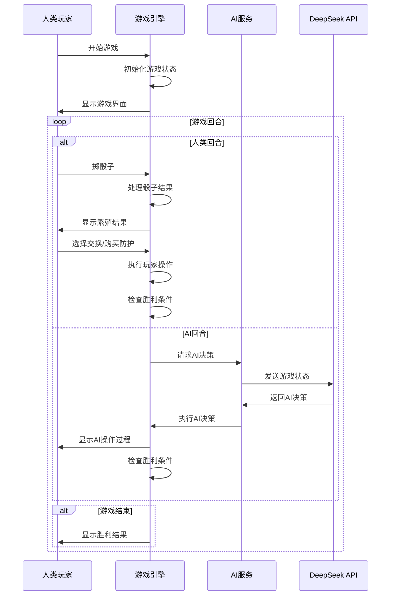

# 超级农场主游戏架构设计

## 1. 前端架构设计

### 1.1 状态管理 (Pinia Store)

```typescript
// gameStore.ts - 游戏核心状态
interface GameState {
  gameId: string;
  currentRound: number;
  currentPlayer: 'human' | 'ai';
  gamePhase: 'preparing' | 'rolling' | 'processing' | 'exchanging' | 'finished';
  winner: string | null;
  bank: {
    rabbit: number;
    sheep: number;
    pig: number;
    cow: number;
    horse: number;
    smallDog: number;
    bigDog: number;
  };
  diceResult: string[];
  gameHistory: GameAction[];
}

// playerStore.ts - 玩家状态
interface PlayerState {
  human: Player;
  ai: Player;
}

interface Player {
  id: string;
  name: string;
  animals: AnimalCollection;
  protection: ProtectionCollection;
  isWinner: boolean;
}

// aiStore.ts - AI状态
interface AIState {
  difficulty: 'easy' | 'medium' | 'hard';
  personality: string;
  isThinking: boolean;
  thinkingMessage: string;
  lastDecision: AIDecision | null;
  decisionHistory: AIDecision[];
}
```

### 1.2 游戏服务层

```typescript
// gameService.ts - 核心游戏逻辑
class GameService {
  // 游戏初始化
  initGame(): void
  
  // 掷骰子
  rollDice(): string[]
  
  // 处理骰子结果
  processDiceResult(player: Player, diceResult: string[]): void
  
  // 动物繁殖计算
  breedAnimals(player: Player, animal: string, diceCount: number): number
  
  // 处理攻击(狐狸/狼)
  processAttack(player: Player, attackType: 'fox' | 'wolf'): void
  
  // 动物交换
  exchangeAnimals(player: Player, exchange: ExchangeAction): boolean
  
  // 购买防护
  buyProtection(player: Player, item: 'smallDog' | 'bigDog'): boolean
  
  // 检查胜利条件
  checkWinCondition(player: Player): boolean
  
  // 验证操作合法性
  validateAction(player: Player, action: GameAction): boolean
}

// aiService.ts - AI接口服务
class AIService {
  // 获取AI决策
  async getAIDecision(gameState: GameState): Promise<AIDecision>
  
  // 执行AI决策
  executeAIDecision(decision: AIDecision): void
  
  // AI难度设置
  setDifficulty(difficulty: string): void
  
  // 显示AI思考过程
  showAIThinking(message: string): void
}
```

### 1.3 组件设计

```typescript
// GameBoard.vue - 主游戏界面
export default {
  components: {
    PlayerArea,
    DiceRoller, 
    ExchangePanel,
    AIThinking,
    GameHistory
  },
  
  setup() {
    const gameStore = useGameStore();
    const playerStore = usePlayerStore();
    const aiStore = useAIStore();
    
    // 游戏流程控制
    const handlePlayerTurn = async () => { /* ... */ };
    const handleAITurn = async () => { /* ... */ };
    
    return {
      gameStore,
      playerStore,
      aiStore,
      handlePlayerTurn,
      handleAITurn
    };
  }
};

// PlayerArea.vue - 玩家区域组件
export default {
  props: {
    player: Object as PropType<Player>,
    isCurrentPlayer: Boolean
  },
  
  components: {
    AnimalCard,
    ProtectionCard
  }
};

// DiceRoller.vue - 骰子组件
export default {
  emits: ['diceRolled'],
  
  setup(props, { emit }) {
    const rollAnimation = ref(false);
    
    const rollDice = async () => {
      rollAnimation.value = true;
      // 播放骰子动画
      await animateRoll();
      const result = gameService.rollDice();
      emit('diceRolled', result);
      rollAnimation.value = false;
    };
    
    return { rollDice, rollAnimation };
  }
};
```

## 2. 后端API架构

### 2.1 Express路由设计

```javascript
// app.js
const express = require('express');
const app = express();

// 中间件
app.use(cors());
app.use(express.json());
app.use(rateLimiter);

// 路由
app.use('/api/ai', aiRoutes);
app.use('/api/game', gameRoutes);

// AI决策路由
// POST /api/ai/decision - 获取AI决策
// GET /api/ai/personalities - 获取AI性格列表
// POST /api/ai/difficulty - 设置AI难度
```

### 2.2 DeepSeek API集成

```javascript
// deepseekService.js
class DeepSeekService {
  constructor(apiKey) {
    this.apiKey = apiKey;
    this.baseURL = 'https://api.deepseek.com/v1/chat/completions';
  }
  
  async getAIDecision(gameState, difficulty = 'medium') {
    const prompt = this.buildPrompt(gameState, difficulty);
    
    const response = await axios.post(this.baseURL, {
      model: 'deepseek-chat',
      messages: [
        {
          role: 'system',
          content: this.getSystemPrompt(difficulty)
        },
        {
          role: 'user',
          content: prompt
        }
      ],
      temperature: this.getTemperature(difficulty),
      max_tokens: 1000
    }, {
      headers: {
        'Authorization': `Bearer ${this.apiKey}`,
        'Content-Type': 'application/json'
      }
    });
    
    return this.parseAIResponse(response.data);
  }
  
  buildPrompt(gameState, difficulty) {
    return `
    你是超级农场主游戏的AI玩家，当前游戏状态如下：
    
    玩家状态：
    - 人类玩家：${JSON.stringify(gameState.players.human)}
    - AI玩家：${JSON.stringify(gameState.players.ai)}
    
    银行状态：${JSON.stringify(gameState.bank)}
    骰子结果：${JSON.stringify(gameState.diceResult)}
    当前回合：${gameState.currentRound}
    
    请根据${difficulty}难度制定策略并返回JSON格式决策...
    `;
  }
  
  getSystemPrompt(difficulty) {
    const prompts = {
      easy: '你是一个谨慎的农场主，优先考虑防护和稳定发展...',
      medium: '你是一个经验丰富的农场主，能够平衡风险和收益...',
      hard: '你是一个激进的农场主，善于精确计算和前瞻规划...'
    };
    return prompts[difficulty] || prompts.medium;
  }
}
```

## 3. 游戏流程设计

### 3.1 单人游戏流程



### 3.2 AI决策流程

```typescript
// AI决策处理流程
class AIDecisionProcessor {
  async processAITurn(gameState: GameState): Promise<void> {
    // 1. 显示AI思考状态
    this.showAIThinking('AI正在分析当前局面...');
    
    // 2. 获取AI决策
    const decision = await this.aiService.getAIDecision(gameState);
    
    // 3. 验证决策合法性
    const validatedDecision = this.validateDecision(decision, gameState);
    
    // 4. 执行决策动作
    for (const action of validatedDecision.actions) {
      await this.executeActionWithAnimation(action);
    }
    
    // 5. 显示AI决策说明
    this.showAIReasoning(validatedDecision.reasoning);
    
    // 6. 检查胜利条件
    this.checkWinCondition();
  }
  
  async executeActionWithAnimation(action: AIAction): Promise<void> {
    switch (action.type) {
      case 'breed':
        await this.animateBreeding(action);
        break;
      case 'exchange':
        await this.animateExchange(action);
        break;
      case 'buyProtection':
        await this.animatePurchase(action);
        break;
    }
  }
}
```

## 4. 性能优化策略

### 4.1 前端优化
- **组件懒加载**：按需加载游戏组件
- **状态缓存**：缓存游戏状态，减少重复计算
- **动画优化**：使用CSS3硬件加速
- **资源预加载**：预加载音效和图片资源

### 4.2 API优化
- **请求缓存**：相似游戏状态复用AI决策
- **批量处理**：一次请求处理多个决策
- **超时控制**：设置API超时和重试机制
- **降级策略**：API失败时使用规则AI

### 4.3 成本控制
- **智能缓存**：缓存常见游戏状态的AI决策
- **令牌优化**：精简prompt，减少不必要信息
- **混合模式**：简单局面用规则AI，复杂局面用DeepSeek
- **频率限制**：限制API调用频率

## 5. 错误处理和降级

```typescript
// 错误处理策略
class ErrorHandler {
  // API调用失败降级
  async handleAPIFailure(gameState: GameState): Promise<AIDecision> {
    console.warn('DeepSeek API调用失败，使用备用AI策略');
    return this.getFallbackDecision(gameState);
  }
  
  // 备用AI决策
  getFallbackDecision(gameState: GameState): AIDecision {
    // 使用简单规则AI
    return this.ruleBasedAI.makeDecision(gameState);
  }
  
  // 网络错误处理
  handleNetworkError(): void {
    this.showMessage('网络连接异常，请检查网络后重试');
  }
}
```

这个架构设计具有以下优势：

1. **模块化**：前后端分离，职责清晰
2. **可扩展**：易于添加新功能和AI策略
3. **可维护**：TypeScript类型安全，代码结构清晰
4. **用户友好**：流畅的动画和交互体验
5. **成本可控**：多层缓存和降级策略
6. **稳定可靠**：完善的错误处理机制

您觉得这个架构设计如何？需要我详细实现某个特定模块吗？ 